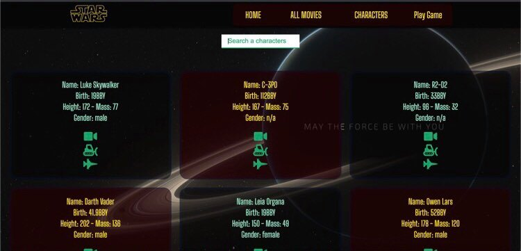

# Quick Install

- **The quickest way to get started is to clone the project and utilize it like this:**

1. Install dependencies from in both **starwarsapi folder** using your command line:

    ### `npm install` 
    
      
2. in  **starwarsapi/package.json** change **"scripts" {"start":"node server.js"} to "start": "react-scripts start"**
   
     
3. in command line **starwarsapi** run the following command:

   ### `npm start`
      
4. Then open your two browser go to:

    - **`http://localhost:3000`** 
      
### Home page:

  

  

  
### Films page:

  

  

  
### Chars page:

  

  

  
### Game page:

  

  

                                                                                                                               
                                                                                                                              

# Deployment : Heroku

- [Star Wars App](https://starwars-13.herokuapp.com/)

# License

   - **ISC**
   
# Author:
- **[Dima](https://github.com/Dima-Kaddah)**

